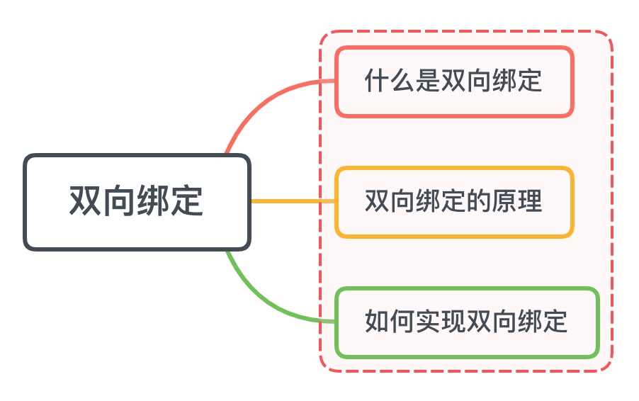
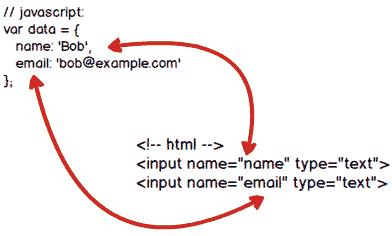
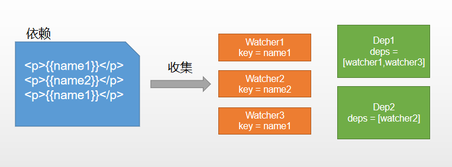

## 一、什么是双向绑定
我们先从单向绑定切入
单向绑定非常简单，就是把Model绑定到View，当我们用JavaScript代码更新Model时，View就会自动更新
双向绑定很容易联想到了，在单向绑定的基础上线，用户更新了View，Model的数据也自动被更新了，这种情况就是双向绑定
举个例子


当用户填写表单时，View的状态就被更新了，如果此时可以自动更新Model的状态，那就相当于我们把Model和View做了双向绑定

关系图如下



## 二、双向绑定的原理是什么
我们都知道Vue是数据双向绑定的框架，双向绑定由三个重要部分组成
+ 数据层（Model）：应用的数据及业务逻辑
+ 视图层（View）：应用的展示效果，各类UI组件
+ 业务逻辑层（ViewModel）：框架封装的核心，它负责将数据与视图关联起来

而上面的这个分层的架构方案，可以用一个专业术语进行称呼MVVM

这里的控制层的核心功能便是“数据双向绑定”。自然，我们只需要弄懂它是什么，便可以进一步了解数据绑定的原理

### 理解ViewModel
它的主要职责就是：
+ 数据变化后更新视图
+ 视图变化后更新数据

当然，它还有两个部分组成
+ 监听器（Observer）：对所有数据的属性进行监听
+ 解析器（Compiler）：对每个元素节点的指令进行扫描跟解析，根据指令模板替换数据，以及绑定相应的更新函数
## 三、实现双向绑定
我们还是以Vue为例，先来看看Vue中的双向绑定流程是什么的
1. new Vue()首先执行初始化，对data执行响应化处理，这个过程发生在Observer中
2. 同时对模板执行编译，找到其中动态绑定的数据，从data中获取并执行初始化视图，这个过程发生在Complie中
3. 同时定义一个更新函数和Watcher，将来对应数据变化时，Watcher会调用更新函数
4. 由于data的某个key在一个视图中可能出现多次，所以每个key都需要一个Dep来管理多个Watcher
5. 将来data中数据一旦发生变化，会首先找到对应的Dep，通知所以Watcher执行更新函数

流程图如下：


### 实现
先来一个构造函数： 执行初始化，对data执行响应处理
```js
class Vue {
  constructor(options) {
    this.$options = options
    this.$data = options.data

    // 对data选项做响应式处理
    observe(this.$data)

    // 代理data到vm上
    proxy(this);

    // 执行编译
    new Compile(options.el, this)
  }
}
```
对data选择执行响应化具体操作
```js
function observe(obj) {
  if (typeof !== "object" || obj == null) {
    return;
  }
  new Observer(obj)
}

class Observer {
  constructor(value) {
    this.value = value;
    this.walk(value);
  }
  walk(obj) {
    Object.keys(obj).forEach((key)=>{
      defineReactive(obj, key, obj[key]);
    })
  }
} 
```
### 编译Compile
对每个元素节点的指令进行扫描跟解析，根据指令模板替换数据，以及绑定相应的更新函数


```js
class Compile {
  constructor(el, vm) {
    this.$vm = vm
    this.$el =  document.querySelector(el);  // 获取dom
    if (this.$el) {
      this.compile(this.$el);
    }
  }
  compile(el) {
    const childNodes = el.childNodes;
    Array.from(childNodes).forEach((node)=>{ // 遍历子元素
      if(this.isElement(node)) {
        console.log("编译元素"+ node.nodeName);
      } else if (this.isInterpolation(node)) {
        console.log("编译插值文本"+ node.textContent) // 判断是否为插值文本 {{}}
      }
      if (node.childNodes && node.childNodes.length > 0) {  // 判断是否有子元素
        this.compile(node); // 对子元素进行递归遍历
      }
    })
  }
  isElement(node) {
    return node.nodeType === 1;
  }
  isInterpolation(node) {
    return node.nodeType == 3 && /\{\{(.*)\}\}/.test(node.textContent);
  }
}
```

### 依赖收集
视图中会用到data中某key，这称为依赖。同一个key可能出现多次，每次都需要收集出来用一个Watcher来维护它们，此过程称为依赖收集
多个Watcher需要一个Dep来管理，需要更新时由Dep统一通知



实现思路
1. defineReactive时为每个key创建一个Dep实例
2. 初始化视图时，读取某个key，例如name1，创建一个Watcher1
3. 由于触发name1的getter方法，便将watcher1添加到name1对应的Dep中
4. 当name1更新，setter触发时，便可以通过对应Dep通知其管理所以Watcher更新
```js
// 负责更新视图
class Watcher {
  constructor(vm, key, updater) {
    this.vm = vm
    this.key = key
    this.updaterFn = updater

    // 创建实例时，把当前实例指定到Dep.target静态属性上
    Dep.target = this
    // 读一下key，触发get
    vm[key]
    // 置空
    Dep.target = null
  }

  // 未来执行dom更新函数，由dep调用的
  update() {
    this.updaterFn.call(this.vm, this.vm[this.key])
  }
}
```

声明Dep

```js
class Dep {
  constructor() {
    this.deps = [];  // 依赖管理
  }
  addDep(dep) {
    this.deps.push(dep);
  }
  notify() { 
    this.deps.forEach((dep) => dep.update());
  }
}
```
创建watcher时触发getter
```js
class Watcher {
  constructor(vm, key, updateFn) {
    Dep.target = this;
    this.vm[this.key];
    Dep.target = null;
  }
}
```
依赖收集，创建Dep实例
```js
function defineReactive(obj, key, val) {
  this.observe(val);
  const dep = new Dep();
  Object.defineProperty(obj, key, {
    get() {
      Dep.target && dep.addDep(Dep.target);// Dep.target也就是Watcher实例
      return val;
    },
    set(newVal) {
      if (newVal === val) return;
      dep.notify(); // 通知dep执行更新方法
    },
  });
}
```